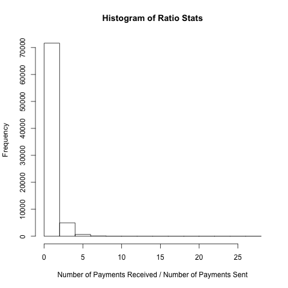

# Table of Contents

1. [Loading the Initial State] (README.md#initial-state)
2. [Stream Processing] (README.md#stream-processing)
3. [Bidirectional Breadth First Search] (README.md#bidirectional-breadth-first-search)
4. [Unusual Behavior](README.md#unusual-behavior)

##Initial State

The main source file run is `antifraud.py`.  The main python codefile containing the substantive part of the code is `adGraph.py`.  Some initial unit test cases are specified in that file.  `adGraph.py` can be run on its own for testing initial cases.  The `read_batch()` method contained within prepares the initial state. We will assume that every line in `batch_payment.txt` consists of `trusted` payments between users. We want to turn this batch file into a suitable data structure such that the validity of any user and any other user can be verified.   The type of data structure we will use in this scenario is a graph.  We assume the size of the `batch_payment.txt` corresponds to the amount of memory we wish to access at any point in time.  In other words, it represents a limit to the amount of RAM we want to access.  When it is imperative that transactions are processed as quickly as possible, storing the batch data in memory is the fastest approach.  

The natural structure of the information as given is in a graph composed of nodes and edges which are the id's of users and the transactions are the edges.  We will assume the edges are unweighted and bidirectional.  When we process the batch file, we will add every edge (transaction) to the graph and add unique edge values to a queue. The natural choice of a queue is based on the idea that we want to delete the edges that we first added, and add edges we have recently encountered when we process the stream data.  The graph itself is composed of a dictionary of unique vertex id's.  The values of the dictionary are of class vertex, which has it's own data and methods.  The vertex instances themselves can access adjacency lists as well as state features.  

##Stream Processing

Each line in `stream_payments.txt` contains valid payments.  The method in `readBatch.py` that implements this step is `read_stream()`.  We update the edges in the graph with each payment and delete the oldest edge from the queue we have established.  As we process each line in `stream_payments.txt`, the results of our processing are forwarded to `paymo_output\outputX.txt` files where `x` is the feature we are implementing.  Because it is cumbersome to append each result to the file as we process, we write to the file in a buffered state.  The bidirectional breadth first search algorithm used to process stream inputs is described in the following section.

##Bidirectional Breadth First Search

Determining the extent of relationship between any two parties in all three features basically boils down to determining the shortest path between vertices.  For unweighted graphs with no direction on the edges, assuming a branching factor of `b` and a depth of `d`, the Breadth First Search has a speed of `b+b^2+ ... + b^d+1 ~ O(b^(d+1))`. The algorithm for breadth first search is well-documented on wikipedia, but essentially is about branching out from a source node indefinitely until the target node is reached.  The number of stages of branching taken to reach the target node is essentially the shortest path distance.   If we instead choose to branch out from the source and target nodes simultaneously, we can halve the depth required if we try to meet in the middle.  I.e. the speed becomes `2b+2b^2+...+2b^(d/2) ~ O(b^(d/2))`.  This asymptotic increase in efficiency is what we will target.'

###Unusual Behavior

While we expect users to be sending and receiving payments with some amount of imbalance in either direction.  We think that if a user is inordinately receiving payments while not sending payments, this is suspicious behavior.  While processing the `batch_payments.csv` initial file we were given, we assessed the distribution of incoming to outgoing payments.  

The ratio data is skewed. Hence a standard assessment of an outlier from a normal distribution might not be appropriate.  Nonetheless, we can calculate that the mean of the ratios is `0.598`.  In other words, on average, a user was more likely to send a payment than receive a payment.  This aligns with our intuition.  Namely because we assume that people use PayMO to pay their friends when splitting bills when an excess number of people are involved or when cash is not available.  While this means that one friend could receive a large number of payments as well, we should not see this occuring for a user with high shortest path distances of over 4.  We flag such a user as suspicious.  From an inspection of the above histogram we chose the cutoff of `10` and flag users in excess of our threshold as suspicious.  Due to the restrictions of this challenge on directory structure, we will print this information to the console rather than outputing to a file.  An argument could reasonably be made that the messages themselves are of value because fraudsters might have a propensity to repeat messages.  Nonetheless, given the small amount of data contained in the messages, we feel that such an approach might be prone to problems with accuracy.  Nonetheless, given more time, we would recommend implementing a bloom filter based assessment to determine if in fact there is an inordinate amount of similarity to a text messages to previous messages.  

